# Architecture

> Supporting detail. The canonical project status and roadmap are maintained in
> `../Nexura_Watchdog_Project_Design_and_Implementation_Record.md`.

## Current scope

The current implementation contains nine deliberately bounded capabilities:

1. The public FastAPI advisory layer validates CVE, GHSA, or OSV identifiers,
   retrieves OSV records, normalizes them into source-neutral domain models, and
   exports JSON or Markdown.
2. An internal repository-intake service resolves and temporarily acquires an
   exact public GitHub revision without Git, authentication, persistence, or
   repository code execution.
3. An internal Phase 3 service discovers and parses allowlisted dependency data
   inside the repository lease, builds a source-linked normalized inventory, and
   checks exact target-advisory candidates with pinned OSV-Scanner 2.4.0.
4. An internal Phase 4 service converts only those match source references into
   deterministic, redacted evidence bundles before the lease is cleaned up.
5. An internal Phase 5 service derives targets from validated Phase 3/4 links,
   performs bounded allowlisted lexical recognition, and creates redacted
   context evidence, an observation graph, and controlled non-classification
   signals before lease cleanup.
6. An internal Phase 6 service runs only over validated Phase 1 and Phase 3–5
   artifacts after cleanup, constructs a bounded deterministic model envelope,
   and accepts evidence-linked inference only after strict response and policy
   validation.
7. Phase 7 coordinates one complete investigation, builds a strict canonical
   evidence-linked report, renders bounded JSON or escaped Markdown, and exposes
   it through a direct stdout-only CLI or a separate disabled literal-loopback
   application with five exact routes.
8. Phase 8 derives provenance-linked source-reported fixed-version candidates
   and, when separately enabled, creates one-token in-memory previews for a
   narrow direct-declaration allowlist before cleanup. After cleanup it assembles
   a separate canonical plan and exposes only fully buffered local projections.
9. Phase 9 provides an installed local launcher, a bounded non-repository
   scanner preflight, and a separately selected guided browser projection over
   the unchanged Phase 7 report and Phase 8 plan.

Repository intake, inventory, matching, evidence, context, investigation, and
remediation
remain internal services. Only the Phase 7 orchestrator exposes their bounded
report projection through the local application; no canonical internal bundle
or repository capability is routed. The pipeline does not generate an SBOM,
execute repository code or package tooling, infer runtime/data-flow reachability
or exposure, persist investigation content, write repository bytes, or generate
commands. Phase 8 previews are structured unapplied review artifacts, not patch
application or evidence of remediation.

Phases 4–9 are complete under their reviewed work orders. Evidence and context
collection remain lease-scoped; investigation runs only over their immutable
outputs after cleanup. Every public route is unchanged.

## Runtime flows

```mermaid
flowchart LR
    Client[API client] --> Validation[Identifier validation]
    Validation --> OSV[OSV adapter]
    OSV --> Advisory[Normalized advisory]
    Advisory --> Export[JSON or escaped Markdown]

    Caller[Trusted internal caller] --> Request[GitHub URL and ref validation]
    Request --> Resolve[Public repository and exact commit resolution]
    Resolve --> Archive[Bounded exact-SHA archive download]
    Archive --> Workspace[Validated extraction into mode-0700 workspace]
    Workspace --> Discovery[Bounded no-follow manifest discovery]
    Discovery --> Parsers[Data-only Python npm and Go parsers]
    Parsers --> Inventory[Normalized inventory and graph]
    Inventory --> Candidates[Exact target-advisory candidates]
    Candidates --> Scanner[Generated coordinates to pinned OSV-Scanner]
    Scanner --> Match[Source-linked match report]
    Match --> Evidence[Bounded redacted evidence bundle]
    Evidence --> Context[Bounded lexical context bundle]
    Context --> RemediationFacts[Source reported candidate derivation]
    RemediationFacts --> Preview[Optional no follow one token in memory preview]
    Preview --> Cleanup[Verified archive and workspace deletion]
    Context --> Cleanup
    Cleanup --> Envelope[Bounded deterministic investigation envelope]
    Envelope --> Loopback[Optional literal-loopback model gateway]
    Loopback --> Validation[Strict schema evidence and policy validation]
    Validation --> Result[Evidence-bound inference result]
    Result --> Report[Canonical evidence-safe report]
    Report --> Plan[Canonical unapplied remediation plan]
    Report --> CLI[Direct stdout-only CLI]
    Report --> LocalApp[Disabled literal-loopback UI and API]
    Plan --> RemediationCLI[Opt-in stdout-only remediate CLI]
    Plan --> LocalApp
    Doctor[watchdog doctor] --> Version[Bounded scanner version preflight]
    Guided[watchdog ui] --> Version
    Version --> Readiness[Controlled readiness state]
    Readiness --> GuidedApp[Guided literal loopback projection]
    GuidedApp --> LocalApp
```

The public advisory flow remains separate from Phase 7 orchestration. The
existing advisory API never acquires or scans a repository. Only an explicit CLI
invocation or request to the separately launched local app enters the bounded
workflow.

## Phase 7 reporting and local-interface architecture

`InvestigationWorkflowService` validates the complete advisory/repository
request before activity, resolves the advisory, and owns one shared admission
deadline. Inventory, matching, evidence, and context execute sequentially inside
one `RepositoryLease`; cancellation joins active workers and cleanup before it is
reported. Phase 6 runs only after verified cleanup, and report assembly receives
only immutable artifacts plus a repository snapshot without a workspace path.

`InvestigationReport` is frozen, extra-forbidden, renderer-independent, and
identified by canonical JSON excluding only its own ID. The assembler rebuilds
the deterministic Phase 6 envelope to prove exact result linkage, selects
evidence deterministically, keeps inference separate from facts, and records
partial coverage and omissions. JSON and Markdown renderers fully buffer and
size-check output before returning bytes; Markdown neutralizes HTML, syntax,
terminal controls, and bidirectional controls.

The CLI calls the workflow in process and has no output-path or HTTP behavior.
The separate web launcher has no module-level listener and refuses startup while
disabled. When explicitly enabled it binds only literal `127.0.0.1` or `::1`,
disables access logs/proxy trust/docs, enforces exact Host and same-origin browser
controls, and serves only `/health`, `/`, two exact assets, and the synchronous
investigation POST. Assets have no external dependencies or browser persistence
and variable values reach only text sinks.

## Phase 8 remediation architecture

`RemediationWorkflowService` rejects disabled use before advisory lookup or
repository acquisition and owns a separate one-slot end-to-end deadline. The
private workflow core is shared with Phase 7: investigations pass no Phase 8
hook, while remediation runs data-only candidate derivation after Phase 5 and
installs the repository-capable preview hook only when preview generation is
enabled. Candidate and preview drafts finish inside the lease. Phase 6, the
unchanged Phase 7 report, `RemediationPlan` assembly, and rendering occur only
after cleanup is verified.

Candidate selection accepts only `affected` or `affected_conditional` exact
scanner-eligible coordinates with a linked non-omitted Phase 4 evidence item.
Targets come only from same-component advisory `fixed` events or unambiguous
same-package remediation fields with exact Phase 1 provenance. Identical target
facts retain every support record. Conditional matches, source conflicts,
multiple target values, incomplete evidence, unsupported grammar, equality, and
downgrades remain explicit manual outcomes. PyPI uses installed PEP 440
comparison; npm uses strict exact SemVer 2.0.0; Go uses canonical `v`-prefixed
module semantic/pseudo-version parsing. The existing Phase 3 Go scanner
coordinate remains unchanged; comparison uses the exact inventory declaration.

`PreviewCollector` accepts no caller path, selector, version, or candidate ID.
It derives one eligible source reference internally. Python permits one exact
unconditional `==` token in `requirements*.txt` or a direct PEP 621 dependency;
Go permits one direct non-replaced `go.mod` requirement; npm uses the reviewed
same-project/root bridge from one affected lockfile coordinate to exactly one
direct exact `package.json` declaration. Descriptor-relative reads reject every
symlink component and non-regular file, bind pre/post identity and Phase 3
digest, and apply the smallest Phase 3/4/8 limits. Prefix and suffix remain
byte-identical around the one replacement, original and hypothetical bytes are
reparsed as data, and only a redacted bounded zero-context display may leave the
collector. No hypothetical byte is written.

The strict plan has separate typed support, candidate, preview, configuration,
and plan identities. It references but never rewrites the Phase 7 report or any
Phase 1–6 identity. Its four statuses distinguish unavailable, manual review,
candidate availability, and a complete preview. Every projection begins with
the fixed no-change/compatibility/completeness limitation. The `remediate` CLI
has no output or apply option. The local route is registered only when both the
existing local-interface flag and remediation flag are enabled; the selected UI
variant adds no apply, command, clipboard, upload, download, storage, or external
asset capability.

## Phase 9 guided-experience architecture

The installed `watchdog` entry point delegates `investigate` and `remediate`
directly to the unchanged Phase 7/8 CLI implementation. `doctor` validates the
existing bounded cross-field configurations and calls `check_scanner_readiness`.
That service accepts only the trusted absolute scanner path, verifies a regular
executable, creates a private control directory, and invokes exactly
`(<scanner>, "--version")` through the existing argument-array subprocess
runner. The operation has a ten-second and 64 KiB-per-stream ceiling, a minimal
proxy-free environment, process-group termination, and fixed result codes. It
never constructs an advisory, repository, registry, or model client.

`watchdog ui` creates a validated settings copy for one process: local
interfaces and Phase 8 candidate planning are on, previews are forced off unless
the explicit option is present, and an optional model identifier enables only
the existing credential-free literal-loopback gateway. Host and port remain the
validated configured literal loopback. The launcher binds a socket before it
prints or opens the fixed root URL, uses an explicit standard-library browser
controller without a shell or environment-selected command template, treats
browser failure as non-fatal, and always closes the listener after Uvicorn
returns. Existing signal handling and application lifespan cleanup remain
controlling.

Guided mode is a trusted `create_app` capability, not an environment setting.
It selects three separate checked-in assets and conditionally registers
`/api/v1/readiness`; legacy asset choices and route tables are unchanged. The
readiness response contains only controlled scanner, AI, remediation, and
preview states. A non-ready scanner gates both workflow POSTs before content-
type/body parsing or any service call. The page uses the same Host, origin,
Fetch Metadata, non-simple local header, no-store, no-CORS, no-cookie, CSP, and
disconnect cleanup controls as Phase 7/8.

The browser renders canonical JSON into status, exact snapshot, dependency
findings, evidence links, model synthesis, coverage, limitations, and validation
actions through DOM construction and `textContent`. Model inference is styled
separately from deterministic facts. Raw JSON or Markdown bytes remain in a
collapsed advanced region. Remediation is a later, independent synchronous POST
with fixed no-apply wording. The page has no download, clipboard, upload,
filesystem, storage, history, external asset, or apply capability.

## Advisory architecture

The API application owns an `httpx.AsyncClient` for its lifespan. A
source-neutral `AdvisoryService` receives an `AdvisorySource` protocol, keeping
HTTP and OSV response details out of the domain layer. FastAPI dependency
injection permits deterministic integration tests without network access.

`AdvisoryRecord` does not import OSV response classes. `field_provenance` maps
normalized JSON Pointer-like paths to the source record, retrieval URL and time,
and upstream JSON path. Raw records remain external evidence, not instructions.
When related records disagree, the merger retains every competing scalar value
and provenance in explicit conflict records.

The public routes remain:

- `GET /health`
- `GET /api/v1/advisories/{identifier}`, with JSON by default and Markdown via
  query parameter or content negotiation

## Repository-intake architecture

### Validation and resolution

`RepositoryRequest` accepts a bounded optional ref. URL parsing accepts only
HTTPS `github.com` URLs with exactly an owner and repository name; credentials,
ports, queries, fragments, percent encoding, and subpaths are rejected. The
canonical repository returned by GitHub must match the requested identity and
must be public.

The GitHub adapter resolves the requested ref—or the reported default branch—to
a 40-character lowercase commit SHA and tree SHA. It then requests the tarball
for that immutable commit, not the mutable branch name. Repository and commit
metadata use `api.github.com`; archive redirects are followed manually and may
remain only on HTTPS `api.github.com` or `codeload.github.com`.

No token is accepted or persisted. No Git process is launched, so hooks,
submodules, working-tree configuration, and `.git` metadata never enter the
workspace.

### Limits and extraction

`RepositoryIntakeService` owns a semaphore shared by its leases. The end-to-end
deadline begins before the semaphore wait and covers resolution, download, and
extraction. The compressed download is streamed to a mode-0600 file with both
`Content-Length` and observed-byte enforcement. Its SHA-256 digest is retained.

Extraction uses Python's tar reader only to enumerate and stream members; it does
not call the general extraction API. The extractor:

- requires one consistent archive root and strips it;
- rejects absolute paths, traversal, empty segments, backslashes, control
  characters, duplicate paths, and case collisions;
- allows regular files, directories, and only lexically contained relative
  symlinks;
- rejects hardlinks, sparse files, devices, FIFOs, unsupported members, and paths
  beneath an earlier symlink;
- enforces regular-file byte, unique workspace-path, relative-path, and deadline
  limits;
- creates directories as mode 0700 and regular files as mode 0600.

The default compressed and extracted limits are each 250 MiB, the file limit is
25,000 unique paths (including implicit directories), the relative-path limit is
1,024 characters, the total deadline is 600 seconds, and concurrency is one
lease per service instance. During extraction,
both the compressed archive and partial output exist, so peak workspace storage
can approach the sum of the two byte limits.

### Lease and cleanup

The service returns a single-use async context manager. On successful entry it
exposes an `AcquiredRepository` containing the temporary source root and an
immutable `RepositorySnapshot`. The archive is removed before the caller sees
the root. The caller must finish all reads within the context.

On normal exit, caller error, source error, limit failure, timeout, or
cancellation, cleanup removes the archive and workspace in a thread and verifies
that neither path remains before releasing the concurrency slot. A failure is a
typed `RepositoryCleanupError` carrying a `CleanupResult`; it is never treated as
successful cleanup. Workspaces cannot be retained through this interface.

## Phase 3 inventory and matching architecture

`DependencyInventoryService` runs its complete discovery and parsing operation
in a worker thread while the async caller retains the Phase 2 lease. It walks in
sorted order without following links; skips VCS, virtual-environment,
`node_modules`, and vendored trees; opens recognized files with no-follow
semantics; hashes every parsed file; and checks a shared cancellation flag and
120-second default deadline between files and major operations.

The allowlist is limited to `pyproject.toml`, `requirements*.txt`, uv lock schema
1, `package.json`, package-lock v2/v3, `go.mod`, and `go.sum`. Parsers use only
Python data libraries (`tomllib`, `json`, and `packaging`). They preserve
constraints, markers, OS/CPU expressions, relationship and scope uncertainty,
local sources, replacements, stable selectors, and explicit warnings. Limits
bound files, per-file/total bytes, nesting, requirements includes, components,
edges, warnings, and duration. Empty, absent, malformed, unsupported, and partial
coverage are distinct states.

Domain models in `watchdog/domain/inventory.py` are source-neutral and immutable.
Project, component, and edge IDs are SHA-256 values over canonical JSON anchored
to the exact commit, project root, ecosystem, normalized identity, version,
condition, and source selector. Every component and edge links to a
repository-relative path, structured JSON/TOML/line selector, and file digest.

`AdvisoryMatchService` selects components only by normalized advisory ecosystem
and package name. Constraints, unknown versions, and non-registry sources remain
visible but are not scan inputs. Exact coordinates are deduplicated into a
generated custom OSV-Scanner intermediate file in a private control directory;
the scanner never receives the repository root or its manifests. A trusted empty
configuration overrides repository configuration.

The embedded scanner is pinned to version 2.4.0 and checked lazily with
`--version`. The check parses the explicit `osv-scanner version:` line and
requires exactly 2.4.0; additive version metadata for separately bundled tools
does not weaken or invalidate that named check. Invocation uses an absolute
executable, argument arrays, `--no-resolve`, a minimal proxy-free environment,
bounded concurrent stdout and stderr reads, a new process session, and
terminate-then-kill process-group cleanup. Exit 0 or 1 is successful only with
schema-valid JSON. All other states produce `scanner_incomplete`. Scanner results
are mapped back to every source occurrence by exact coordinate and advisory
ID/alias; conditions are never evaluated against the host.

## Phase 4 evidence architecture

Phase 4 adds an in-process evidence service after matching and before lease
cleanup:

```mermaid
flowchart LR
    Match[Phase 3 match report] --> References[Watchdog-generated source references]
    References --> Reader[Descriptor-based bounded no-follow reader]
    Reader --> Resolver[Allowlisted positional selector resolver]
    Resolver --> Redactor[Fail-closed deterministic redaction]
    Redactor --> Items[Canonical evidence items]
    Items --> Bundle[Deterministic internal evidence bundle]
    Bundle --> Cleanup[Verified lease cleanup]
```

The service accepts only the acquired repository, inventory, and match report
for the same exact snapshot. It deduplicates Phase 3 source references and opens
only those normalized repository-relative paths. It walks every path component
with directory file descriptors and no-follow flags, reads the final regular file
under per-file and aggregate limits, and requires its digest to match the Phase 3
reference before extracting content.

Line, JSON Pointer, and TOML selectors use allowlisted bounded positional
resolvers for the existing dependency formats. Unsupported, ambiguous, stale,
or changed references produce omitted-content evidence and partial coverage.
They do not trigger broader discovery or a clean negative result.

Unredacted selected content exists only transiently inside the bounded redactor.
Only redacted display text and its digest may enter immutable domain models.
Redaction failure, invalid text, or limit exhaustion omits content and emits a
safe structured warning. Warnings and exceptions never include repository text.

The absolute 10,000-item cap does not silently discard source references.
Overflow references remain in canonical per-match source outcomes with
`item_limit_exceeded` and no evidence ID. This keeps the output bounded without
creating unlimited omitted-content items or losing Phase 3 provenance.

Canonical evidence and bundle identities include the snapshot, source-file
digest, selector, validated line range, producer/resolver/redaction versions,
and configuration. Canonical bundles omit wall-clock times and temporary paths,
sort all items and links, and must be byte-for-byte deterministic for the same
inputs.

The complete schema, default limits, implementation boundary, and acceptance
tests are retained in `docs/work-orders/phase-4-evidence-engine.md`.

## Phase 5 contextual-analysis architecture

Phase 5 is complete under `../work-orders/phase-5-contextual-analysis.md` and the
gates in `../plans/phase-5-implementation-plan.md`.

`ContextService` is a separate internal service invoked only while
the Phase 2 repository lease is active. It accepts same-snapshot Phase 3
inventory/matches and the Phase 4 evidence bundle, derives targets from those
validated inputs plus a trusted code-native catalog, performs bounded descriptor-
relative discovery, runs data-only language recognizers, redacts selected spans,
and constructs a deterministic context observation bundle. It does not extend
`EvidenceService` path eligibility or mutate Phase 4 evidence identities.

The service validates all input linkage before opening the repository. Its
checked-in catalog has canonical identity, fixed package/import mappings, and
reviewed member, configuration, and endpoint rules. Discovery uses a private,
sorted descriptor walker with no-follow opens, pre/post metadata checks, fixed
directory exclusions, source/configuration allowlists, and explicit duration,
path, directory, file, byte, token, observation, evidence, graph, redaction, and
warning limits.

Python uses the standard-library tokenizer; JavaScript/TypeScript and Go use
bounded data-only lexical recognizers; JSON/TOML configuration recognition is
limited to exact catalog-selected paths and keys. Unsupported or ambiguous
syntax, mapping gaps, mutation, redaction failure, or exhaustion produces
explicit partial coverage. Async cancellation waits for the worker to terminate
before the lease can clean up.

Recognizers accept configuration observations only for supported literal values.
JavaScript imports must match a reviewed static/literal import form, and Go
selector references or calls require an explicit import alias because an import
path alone does not prove the package's declared identifier. A redacted context
span that exceeds an item or remaining bundle display budget is omitted rather
than truncated. Final schema validation binds each observation, graph
relationship, signal, and file digest to related canonical evidence.

The graph contains lexical observations only. Imports, explicit
references/calls, reviewed configuration entries, and endpoint proximity do not
assert execution, data flow, runtime reachability, deployment exposure,
exploitability, or repository affected status. A guarded static non-observation
signal is permitted only with complete eligible coverage and a complete target
mapping.

## Phase 6 model-investigation architecture

The implemented `InvestigationService` runs after Phase 2–5 repository work and
cleanup have completed. It accepts only validated normalized advisory data and
canonical Phase 3–5 artifacts; it does not accept a repository lease, path,
archive, raw source record, or filesystem capability.

A deterministic envelope builder selects bounded allowlisted advisory facts,
relevant exact matches, safe Phase 4 evidence, Phase 5 evidence, observations,
graph relationships, signals, and explicit coverage state. Fixed versioned
prompt assets submit that canonical JSON through a provider-neutral gateway.
Untrusted response bytes must pass strict JSON, schema, bounds, evidence-link,
and deterministic disposition-policy validation before becoming an immutable
investigation result. Model output remains an inference over evidence, never new
evidence.

The sole concrete transport is disabled by default, credential-free,
and restricted to a literal loopback OpenAI-compatible endpoint with redirects
and ambient proxies disabled. Remote providers, credentials, persistence,
interfaces, tool calls, streaming, affected/not-affected classification,
reachability/exposure, remediation, and patches are excluded.

## Module responsibilities

| Module | Responsibility |
| --- | --- |
| `watchdog/domain/advisories.py` | Immutable normalized advisory, provenance, source, and conflict models |
| `watchdog/domain/identifiers.py` | Canonicalization and allowlisted advisory identifier syntax |
| `watchdog/domain/repositories.py` | Immutable request, resolution, snapshot, acquisition, and cleanup models |
| `watchdog/domain/inventory.py` | Immutable projects, components, edges, source references, warnings, and coverage |
| `watchdog/domain/matching.py` | Exact scanner coordinates, run evidence, match states, and reports |
| `watchdog/domain/evidence.py` | Strict immutable producer, source, redaction, item, link, warning, coverage, configuration, and bundle models |
| `watchdog/domain/context.py` | Strict immutable target, catalog, observation, graph, signal, coverage, and bundle models |
| `watchdog/domain/investigation.py` | Strict immutable envelope, response, claim, run-status, coverage, and result models |
| `watchdog/domain/remediation.py` | Strict immutable support, candidate, preview, plan, coverage, request, and rendered-plan models |
| `watchdog/domain/errors.py` | Base expected-failure vocabulary independent of HTTP |
| `watchdog/vulnerability_sources/` | OSV boundary, normalization, and source-neutral contracts |
| `watchdog/advisory_service.py` | Identifier-to-source orchestration |
| `watchdog/reporting/exporters.py` | JSON and escaped Markdown rendering |
| `watchdog/repository/validation.py` | Public GitHub URL validation and canonicalization |
| `watchdog/repository/github.py` | Public metadata, exact-commit resolution, and bounded archive download |
| `watchdog/repository/workspace.py` | Defensive tar validation and extraction |
| `watchdog/repository/cleanup.py` | Cancellation-safe removal and post-removal verification |
| `watchdog/repository/intake.py` | Deadline, concurrency, workspace, lease, and lifecycle orchestration |
| `watchdog/inventory/` | Bounded discovery, deterministic identifiers, and Python/npm/Go data parsers |
| `watchdog/scanners/` | Source-neutral scanner protocol and pinned OSV-Scanner subprocess boundary |
| `watchdog/advisory_match_service.py` | Candidate selection, alias matching, and source-linked match reporting |
| `watchdog/evidence/` | Canonical IDs/configuration, descriptor-relative reads, positional selectors, redaction, and lease-scoped collection |
| `watchdog/context/` | Trusted catalog, target derivation, descriptor discovery, data-only recognizers, context evidence, lexical graph/ranking, and lease-scoped collection |
| `watchdog/investigation/` | Canonical envelope selection, fixed prompt/schema assets, gateway protocol, strict validation/policy, loopback adapter, and internal service |
| `watchdog/reporting/` | Phase 7 report identity/configuration, assembly, controlled wording, and bounded renderers |
| `watchdog/remediation/` | Phase 8 identities, limits, version comparators, candidate derivation, no-write preview collection, assembly, and bounded renderers |
| `watchdog/readiness.py` | Phase 9 bounded scanner preflight, cross-field configuration validation, and controlled guided capability projection |
| `watchdog/launcher.py` | Installed command dispatch, per-process guided settings, fixed browser target, and pre-bound Uvicorn lifecycle |
| `watchdog/workflow/` | Fixed-order lease-safe orchestration, runtime composition, admission, deadline, and cancellation |
| `apps/api` | Advisory API lifespan, dependencies, error mapping, and routes |
| `apps/cli` | Direct stdout-only investigation and opt-in remediation adapters |
| `apps/web` | Disabled legacy literal-loopback launcher, exact gated routes/security, and separately selected Phase 7/8/9 checked-in UI variants |

## Deployment and deferred architecture

Native development uses Python 3.12+ and an absolute scanner path. The Docker
image is based on `python:3.12-slim` and copies `/osv-scanner` from the pinned
v2.4.0 multi-architecture image digest. Docker Compose starts the standalone
image without a source bind mount and still exposes only the advisory API.
Intake workspaces are local process resources and are not a durable data model.

The scanner increases image size and requires normal outbound OSV lookup access;
`--no-resolve` prevents dependency-resolution egress. The bounded internal
evidence and context services add no egress or public route. Phase 6 adds only an
explicitly enabled literal-loopback destination. Phase 7 adds no outbound
destination and keeps its inbound listener disabled, literal-loopback, and
unpublished by the default container. Still deferred are SBOM generation,
source-to-sink/runtime reachability, exposure classifications, remote model
providers, credentials, persistence, background jobs, evidence browsing,
remote/production interfaces, repository writes/apply behavior, multi-token or
multi-file previews, lock/checksum changes, commands, registry queries, and
general source patches. Exposing internal bundles, binding
beyond loopback, or changing the scanner version/network behavior requires a new
boundary review.

`../work-orders/phase-5-contextual-analysis.md` defines the implemented separate
context service within its documented limits. Phase 5 does not broaden Phase 4
source-reference eligibility or rewrite Phase 4 evidence identities.

`../work-orders/phase-6-evidence-bound-model-investigation.md` and
`../plans/phase-6-implementation-plan.md` define the completed internal
investigation boundary.

`../work-orders/phase-7-reporting-and-local-interfaces.md` and
`../plans/phase-7-implementation-plan.md` define the completed canonical report,
bounded orchestration, direct local CLI, and separate disabled literal-loopback
UI/API boundary.

`../work-orders/phase-8-remediation-assistant.md` and
`../plans/phase-8-implementation-plan.md` define the completed evidence-linked
candidate, validation-action, in-memory preview, no-write, and local-interface
architecture.

`../work-orders/phase-9-local-first-guided-experience.md` and
`../plans/phase-9-implementation-plan.md` define the completed installed
launcher, readiness, fixed browser target, guided admission, progressive UI,
and legacy-regression boundary. Hosted or non-loopback service, authentication,
installation, persistence, repository mutation, and release publication remain
deferred.
