# Architecture

> Supporting detail. The canonical project status and roadmap are maintained in
> `../Nexura_Watchdog_Project_Design_and_Implementation_Record.md`.

## Current scope

The current implementation contains four deliberately bounded capabilities:

1. The public FastAPI advisory layer validates CVE, GHSA, or OSV identifiers,
   retrieves OSV records, normalizes them into source-neutral domain models, and
   exports JSON or Markdown.
2. An internal repository-intake service resolves and temporarily acquires an
   exact public GitHub revision without Git, authentication, persistence, or
   repository code execution.
3. An internal Phase 3 service discovers and parses allowlisted dependency data
   inside the repository lease, builds a source-linked normalized inventory, and
   checks exact target-advisory candidates with pinned OSV-Scanner 2.4.0.
4. An internal Phase 4 service converts only those match source references into
   deterministic, redacted evidence bundles before the lease is cleaned up.

Repository intake, inventory, matching, and evidence have no HTTP routes. The
implemented internal pipeline does not
generate an SBOM, execute repository code or package tooling, infer source
reachability/exposure, call an LLM, persist content, or generate patches.

Phase 4 is complete under the reviewed work order. Evidence collection remains
internal and lease-scoped, and every public route is unchanged.

## Runtime flows

```mermaid
flowchart LR
    Client[API client] --> Validation[Identifier validation]
    Validation --> OSV[OSV adapter]
    OSV --> Advisory[Normalized advisory]
    Advisory --> Export[JSON or escaped Markdown]

    Caller[Trusted internal caller] --> Request[GitHub URL and ref validation]
    Request --> Resolve[Public repository and exact commit resolution]
    Resolve --> Archive[Bounded exact-SHA archive download]
    Archive --> Workspace[Validated extraction into mode-0700 workspace]
    Workspace --> Discovery[Bounded no-follow manifest discovery]
    Discovery --> Parsers[Data-only Python npm and Go parsers]
    Parsers --> Inventory[Normalized inventory and graph]
    Inventory --> Candidates[Exact target-advisory candidates]
    Candidates --> Scanner[Generated coordinates to pinned OSV-Scanner]
    Scanner --> Match[Source-linked match report]
    Match --> Evidence[Bounded redacted evidence bundle]
    Evidence --> Cleanup[Verified archive and workspace deletion]
```

The public advisory flow remains separate from internal orchestration. A trusted
caller can join an advisory and inventory with `AdvisoryMatchService`, but no
public request acquires or scans a repository.

## Advisory architecture

The API application owns an `httpx.AsyncClient` for its lifespan. A
source-neutral `AdvisoryService` receives an `AdvisorySource` protocol, keeping
HTTP and OSV response details out of the domain layer. FastAPI dependency
injection permits deterministic integration tests without network access.

`AdvisoryRecord` does not import OSV response classes. `field_provenance` maps
normalized JSON Pointer-like paths to the source record, retrieval URL and time,
and upstream JSON path. Raw records remain external evidence, not instructions.
When related records disagree, the merger retains every competing scalar value
and provenance in explicit conflict records.

The public routes remain:

- `GET /health`
- `GET /api/v1/advisories/{identifier}`, with JSON by default and Markdown via
  query parameter or content negotiation

## Repository-intake architecture

### Validation and resolution

`RepositoryRequest` accepts a bounded optional ref. URL parsing accepts only
HTTPS `github.com` URLs with exactly an owner and repository name; credentials,
ports, queries, fragments, percent encoding, and subpaths are rejected. The
canonical repository returned by GitHub must match the requested identity and
must be public.

The GitHub adapter resolves the requested ref—or the reported default branch—to
a 40-character lowercase commit SHA and tree SHA. It then requests the tarball
for that immutable commit, not the mutable branch name. Repository and commit
metadata use `api.github.com`; archive redirects are followed manually and may
remain only on HTTPS `api.github.com` or `codeload.github.com`.

No token is accepted or persisted. No Git process is launched, so hooks,
submodules, working-tree configuration, and `.git` metadata never enter the
workspace.

### Limits and extraction

`RepositoryIntakeService` owns a semaphore shared by its leases. The end-to-end
deadline begins before the semaphore wait and covers resolution, download, and
extraction. The compressed download is streamed to a mode-0600 file with both
`Content-Length` and observed-byte enforcement. Its SHA-256 digest is retained.

Extraction uses Python's tar reader only to enumerate and stream members; it does
not call the general extraction API. The extractor:

- requires one consistent archive root and strips it;
- rejects absolute paths, traversal, empty segments, backslashes, control
  characters, duplicate paths, and case collisions;
- allows regular files, directories, and only lexically contained relative
  symlinks;
- rejects hardlinks, sparse files, devices, FIFOs, unsupported members, and paths
  beneath an earlier symlink;
- enforces regular-file byte, unique workspace-path, relative-path, and deadline
  limits;
- creates directories as mode 0700 and regular files as mode 0600.

The default compressed and extracted limits are each 250 MiB, the file limit is
25,000 unique paths (including implicit directories), the relative-path limit is
1,024 characters, the total deadline is 600 seconds, and concurrency is one
lease per service instance. During extraction,
both the compressed archive and partial output exist, so peak workspace storage
can approach the sum of the two byte limits.

### Lease and cleanup

The service returns a single-use async context manager. On successful entry it
exposes an `AcquiredRepository` containing the temporary source root and an
immutable `RepositorySnapshot`. The archive is removed before the caller sees
the root. The caller must finish all reads within the context.

On normal exit, caller error, source error, limit failure, timeout, or
cancellation, cleanup removes the archive and workspace in a thread and verifies
that neither path remains before releasing the concurrency slot. A failure is a
typed `RepositoryCleanupError` carrying a `CleanupResult`; it is never treated as
successful cleanup. Workspaces cannot be retained through this interface.

## Phase 3 inventory and matching architecture

`DependencyInventoryService` runs its complete discovery and parsing operation
in a worker thread while the async caller retains the Phase 2 lease. It walks in
sorted order without following links; skips VCS, virtual-environment,
`node_modules`, and vendored trees; opens recognized files with no-follow
semantics; hashes every parsed file; and checks a shared cancellation flag and
120-second default deadline between files and major operations.

The allowlist is limited to `pyproject.toml`, `requirements*.txt`, uv lock schema
1, `package.json`, package-lock v2/v3, `go.mod`, and `go.sum`. Parsers use only
Python data libraries (`tomllib`, `json`, and `packaging`). They preserve
constraints, markers, OS/CPU expressions, relationship and scope uncertainty,
local sources, replacements, stable selectors, and explicit warnings. Limits
bound files, per-file/total bytes, nesting, requirements includes, components,
edges, warnings, and duration. Empty, absent, malformed, unsupported, and partial
coverage are distinct states.

Domain models in `watchdog/domain/inventory.py` are source-neutral and immutable.
Project, component, and edge IDs are SHA-256 values over canonical JSON anchored
to the exact commit, project root, ecosystem, normalized identity, version,
condition, and source selector. Every component and edge links to a
repository-relative path, structured JSON/TOML/line selector, and file digest.

`AdvisoryMatchService` selects components only by normalized advisory ecosystem
and package name. Constraints, unknown versions, and non-registry sources remain
visible but are not scan inputs. Exact coordinates are deduplicated into a
generated custom OSV-Scanner intermediate file in a private control directory;
the scanner never receives the repository root or its manifests. A trusted empty
configuration overrides repository configuration.

The embedded scanner is pinned to version 2.4.0 and checked lazily with
`--version`. The check parses the explicit `osv-scanner version:` line and
requires exactly 2.4.0; additive version metadata for separately bundled tools
does not weaken or invalidate that named check. Invocation uses an absolute
executable, argument arrays, `--no-resolve`, a minimal proxy-free environment,
bounded concurrent stdout and stderr reads, a new process session, and
terminate-then-kill process-group cleanup. Exit 0 or 1 is successful only with
schema-valid JSON. All other states produce `scanner_incomplete`. Scanner results
are mapped back to every source occurrence by exact coordinate and advisory
ID/alias; conditions are never evaluated against the host.

## Phase 4 evidence architecture

Phase 4 adds an in-process evidence service after matching and before lease
cleanup:

```mermaid
flowchart LR
    Match[Phase 3 match report] --> References[Watchdog-generated source references]
    References --> Reader[Descriptor-based bounded no-follow reader]
    Reader --> Resolver[Allowlisted positional selector resolver]
    Resolver --> Redactor[Fail-closed deterministic redaction]
    Redactor --> Items[Canonical evidence items]
    Items --> Bundle[Deterministic internal evidence bundle]
    Bundle --> Cleanup[Verified lease cleanup]
```

The service accepts only the acquired repository, inventory, and match report
for the same exact snapshot. It deduplicates Phase 3 source references and opens
only those normalized repository-relative paths. It walks every path component
with directory file descriptors and no-follow flags, reads the final regular file
under per-file and aggregate limits, and requires its digest to match the Phase 3
reference before extracting content.

Line, JSON Pointer, and TOML selectors use allowlisted bounded positional
resolvers for the existing dependency formats. Unsupported, ambiguous, stale,
or changed references produce omitted-content evidence and partial coverage.
They do not trigger broader discovery or a clean negative result.

Unredacted selected content exists only transiently inside the bounded redactor.
Only redacted display text and its digest may enter immutable domain models.
Redaction failure, invalid text, or limit exhaustion omits content and emits a
safe structured warning. Warnings and exceptions never include repository text.

The absolute 10,000-item cap does not silently discard source references.
Overflow references remain in canonical per-match source outcomes with
`item_limit_exceeded` and no evidence ID. This keeps the output bounded without
creating unlimited omitted-content items or losing Phase 3 provenance.

Canonical evidence and bundle identities include the snapshot, source-file
digest, selector, validated line range, producer/resolver/redaction versions,
and configuration. Canonical bundles omit wall-clock times and temporary paths,
sort all items and links, and must be byte-for-byte deterministic for the same
inputs.

The complete schema, default limits, implementation boundary, and acceptance
tests are retained in `docs/work-orders/phase-4-evidence-engine.md`.

## Module responsibilities

| Module | Responsibility |
| --- | --- |
| `watchdog/domain/advisories.py` | Immutable normalized advisory, provenance, source, and conflict models |
| `watchdog/domain/identifiers.py` | Canonicalization and allowlisted advisory identifier syntax |
| `watchdog/domain/repositories.py` | Immutable request, resolution, snapshot, acquisition, and cleanup models |
| `watchdog/domain/inventory.py` | Immutable projects, components, edges, source references, warnings, and coverage |
| `watchdog/domain/matching.py` | Exact scanner coordinates, run evidence, match states, and reports |
| `watchdog/domain/evidence.py` | Strict immutable producer, source, redaction, item, link, warning, coverage, configuration, and bundle models |
| `watchdog/domain/errors.py` | Base expected-failure vocabulary independent of HTTP |
| `watchdog/vulnerability_sources/` | OSV boundary, normalization, and source-neutral contracts |
| `watchdog/advisory_service.py` | Identifier-to-source orchestration |
| `watchdog/reporting/exporters.py` | JSON and escaped Markdown rendering |
| `watchdog/repository/validation.py` | Public GitHub URL validation and canonicalization |
| `watchdog/repository/github.py` | Public metadata, exact-commit resolution, and bounded archive download |
| `watchdog/repository/workspace.py` | Defensive tar validation and extraction |
| `watchdog/repository/cleanup.py` | Cancellation-safe removal and post-removal verification |
| `watchdog/repository/intake.py` | Deadline, concurrency, workspace, lease, and lifecycle orchestration |
| `watchdog/inventory/` | Bounded discovery, deterministic identifiers, and Python/npm/Go data parsers |
| `watchdog/scanners/` | Source-neutral scanner protocol and pinned OSV-Scanner subprocess boundary |
| `watchdog/advisory_match_service.py` | Candidate selection, alias matching, and source-linked match reporting |
| `watchdog/evidence/` | Canonical IDs/configuration, descriptor-relative reads, positional selectors, redaction, and lease-scoped collection |
| `apps/api` | Advisory API lifespan, dependencies, error mapping, and routes |

## Deployment and deferred architecture

Native development uses Python 3.12+ and an absolute scanner path. The Docker
image is based on `python:3.12-slim` and copies `/osv-scanner` from the pinned
v2.4.0 multi-architecture image digest. Docker Compose starts the standalone
image without a source bind mount and still exposes only the advisory API.
Intake workspaces are local process resources and are not a durable data model.

The scanner increases image size and requires normal outbound OSV lookup access;
`--no-resolve` prevents dependency-resolution egress. The bounded internal
evidence engine adds no egress or public route. Still deferred are SBOM
generation, general source analysis,
reachability, exposure classifications, LLM providers, persistence, background
jobs, evidence browsing, CLI workflows, web UI, and patch previews. Exposing
internal Phase 2–4 services through an API or changing the scanner
version/network behavior requires a new boundary review.

`../work-orders/phase-5-contextual-analysis.md` proposes a separate internal
context service for that next review. It is not current runtime architecture and
does not authorize source discovery or analysis code. In particular, Phase 5
must not broaden Phase 4 source-reference eligibility in place.
